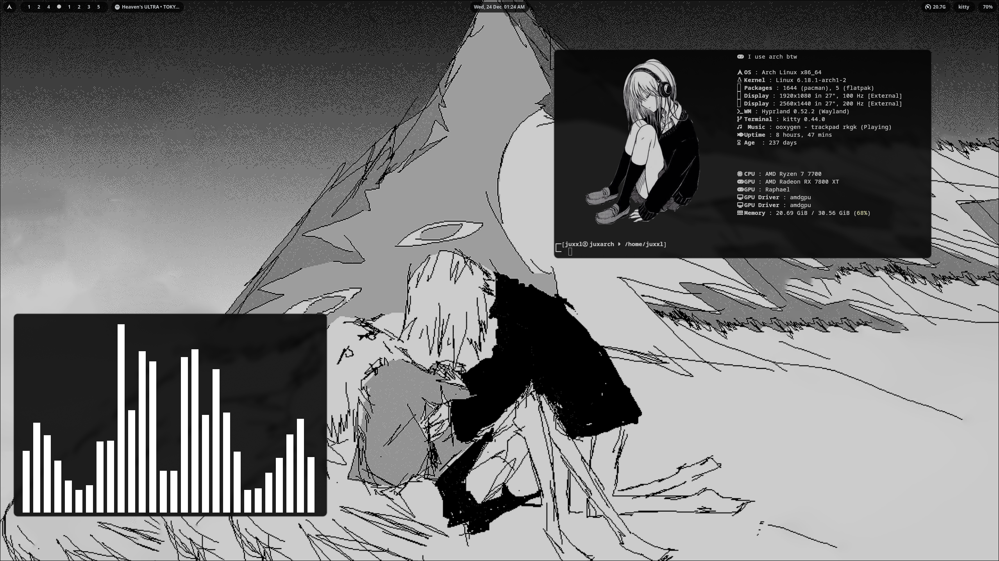
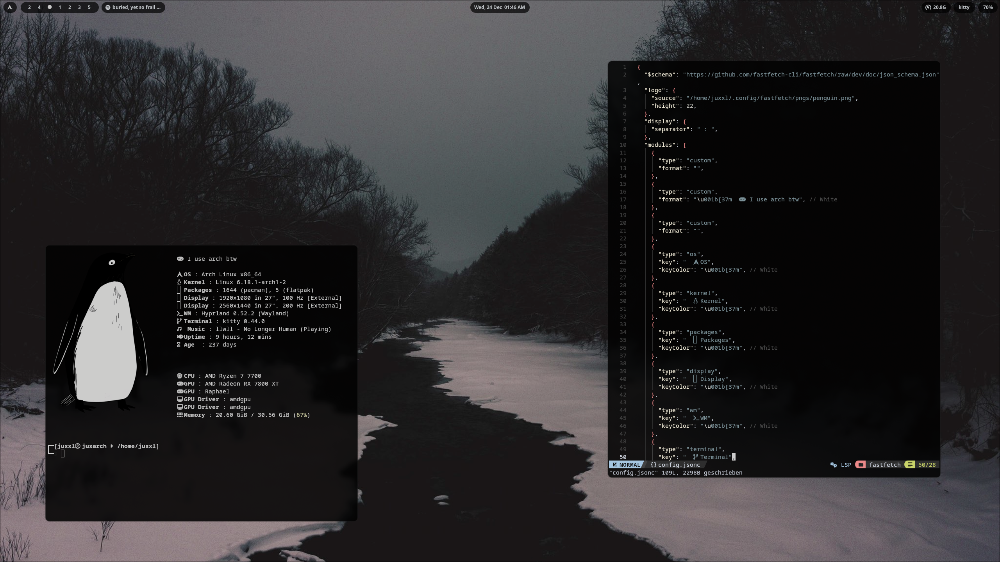

# 🗂️ arch-dotfiles

My personal **Arch Linux dotfiles**.

Minimal, functional, and constantly evolving.  
Mostly focused on workflow, aesthetics, and keeping things simple.

---

## ✨ What’s inside

- 🖥️ Window manager & desktop configs  
- 🎨 Theme, fonts, colors  
- 🖼️ Wallpapers  
- 🔧 Application configs (terminal, editor, etc.)

---

## ⚠️ Disclaimer

These dotfiles are **opinionated** and tailored to **my setup**.  
Use as reference, not a one-click install.

---

## 📸 Preview

<p align="center">
  
</p>
<p align="center">
  
</p>

---

## 🛠️ Setup

Clone and symlink manually:

```bash
git clone https://github.com/juxxxl/arch-dotfiles.git
```
To change the Picture in fastfetch:

```bash
cd ~/fastfetch

```


```bash
# in -->
config.jsonc

# edit this line and replace {img path} with the path to the image you would like to have there

"source": "{img path]", # line 4 

# there are a couple of images i use myself in ~/fastfetch/pngs if you dont have any :3 


```

Pick what you need, don’t blindly copy everything.

---

## 📜 License

MIT — steal whatever helps you.
